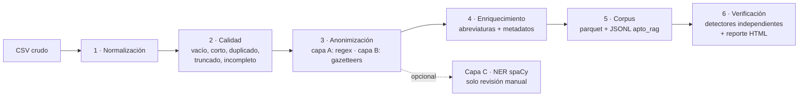

# Anonimización de notas clínicas de trauma para un RAG

Pipeline en Python que toma un registro hospitalario de atención de trauma
(texto libre en español, escrito en urgencias) y lo convierte en un corpus
**anonimizado, limpio y con metadatos**, listo para indexarse en un sistema de
recuperación aumentada (RAG). Es la primera mitad de un proyecto de dos partes;
la segunda es el prototipo RAG que consume este corpus:
**[trauma-rag](https://github.com/hoseStr/trauma-rag)**.

> **Sin datos.** Este repositorio contiene solo código, configuración y
> documentación. El registro clínico original, el corpus generado y los
> reportes con texto no se publican (ver [Privacidad](#privacidad-de-los-datos)).
> Las cifras de este README son agregados de la corrida real.

## Resultados sobre el registro real

| | |
|---|---|
| Registros de entrada | **27.157** notas de urgencias de trauma |
| Indexables (no vacíos, no duplicados, no demasiado cortos) | 22.176 |
| **Aptos para el RAG** (los tres campos completos y sin truncar) | **8.198** |
| Reemplazos de PHI realizados | 9.246 (fechas 5.049 · horas 1.841 · edades 750 · instituciones 1.032 · municipios 290 · médicos 191 · …) |
| Residuo detectado por verificadores independientes | **0,31 %** de documentos con algo por revisar; cero en fechas, horas, documentos y médicos |
| Tiempo de la corrida completa | ~20 s en un portátil |
| Tests | 83 (`pytest`) |

## Qué hace



| Fase | Módulo | Qué produce |
|---|---|---|
| 1 | `src/normalize.py` | Texto limpio: comillas rotas del export, espacios, saltos de línea |
| 2 | `src/quality.py` | Banderas de calidad por registro (`empty`, `too_short`, `duplicate`, `truncated`, `incompleto`) |
| 3 | `src/anonymize.py` | Texto con placeholders (`[FECHA]`, `[EDAD:40-49]`, `[INSTITUCION]`, `[MEDICO]`…) y un log de auditoría por reemplazo |
| 4 | `src/enrich.py` | Abreviaturas expandidas y metadatos: mecanismo de lesión, región anatómica, desenlace, pediátrico |
| 5 | `src/build_corpus.py` | `corpus.parquet` (todo) y `corpus_indexable.jsonl` (solo lo apto para el RAG) |
| 6 | `src/verify.py` | Residuo de PHI medido con detectores **distintos** a los que reemplazaron, muestra estratificada para revisión manual y reporte HTML |
| C | `src/ner_review.py` | NER de spaCy filtrado, como lista de candidatos para revisar a mano (no reemplaza) |

El esquema completo de salida está en [`DICCIONARIO_DATOS.md`](DICCIONARIO_DATOS.md).

### Ejemplo (ficticio)

```text
Entrada:  PACIENTE DE 45 AÑOS REMITIDO DEL HOSPITAL ERNESTO GIL TRUJILLO EL 06/12/2014
          A LAS 18:47, VALORADO POR DR. VILLALOBOS. HPAF EN TORAX CON HIPOVENTILACION
Salida:   PACIENTE DE [EDAD:40-49] REMITIDO DEL HOSPITAL [INSTITUCION] EL [FECHA]
          A LAS [HORA], VALORADO POR [MEDICO]. HPAF (herida por arma de fuego) EN TORAX
          CON HIPOVENTILACION
Metadatos: mecanismo_lesion=arma_de_fuego · region_anatomica=[torax] · abreviaturas=[hpaf]
```

"Trujillo" es también un municipio: el pipeline aplica instituciones antes que
municipios, con excepciones explícitas, para no partir el nombre en dos
placeholders. Hay un test para eso.

## Decisiones de diseño

**Se generaliza, no se suprime.** `[FECHA]`, `[INSTITUCION]`, `[EDAD:80-89]`.
El placeholder conserva la estructura de la frase (mejor embedding), le dice
al generador que ahí había un dato en vez de dejar un hueco que tiende a
rellenar, y deja el resultado auditable. Las edades siguen Safe Harbor: `≥90`
colapsa a `[EDAD:90+]`.

**Se marca, no se borra.** Ningún registro desaparece del `.parquet`. La
columna `apto_rag` decide qué entra al índice y se recalcula sin reprocesar.

**Solo casos completos entran al índice.** El RAG es un asistente de apoyo a la
decisión: un caso cortado o sin evolución es justo el que el generador tiende a
completar inventando el manejo o el desenlace. Fuera: 2.865 registros truncados
y 11.113 con algún campo vacío. `--incluir-incompletos` reproduce el criterio
amplio para comparar.

**Truncado se detecta por el tope del export, no por la puntuación.** El export
cortó dos campos a 500 caracteres. El histograma de longitudes mostró un pico
anómalo en 495–499, así que un campo con ≥480 caracteres se trata como cortado.
Lejos del tope, solo cuenta una frase que termina en palabra funcional
(`...AL RECUPERARLA SE`). Terminar sin punto no es señal: `...SE DA SALIDA` es
la forma habitual de cerrar una nota, y la heurística anterior marcaba así
~2.200 casos completos.

**Reglas asimétricas para instituciones.** En este corpus "hospital" casi
siempre precede al nombre de una IPS, mientras que "clínica" es adjetivo la
mitad de las veces ("evolución clínica satisfactoria", 100+ apariciones). Por
eso `hospital` usa lista negra de genéricos y `clínica` usa lista blanca de
nombres. Con una regla única se pierde contenido clínico o se filtra PHI, según
hacia dónde se incline.

**El NER no reemplaza.** Sin filtros, `es_core_news_lg` produjo 26.078
entidades únicas sobre 3.000 documentos: `HERIDA` como ORG, `TRAUMA` como LOC,
`TRANSITO` como PER. El modelo está entrenado sobre prosa periodística y el
texto clínico en mayúsculas lo descalabra. La capa C aplica tres filtros y
entrega una lista para revisar a mano.

**Expansión aumentativa de abreviaturas.** `HPAF` → `HPAF (herida por arma de
fuego)`, no se sustituye. El documento indexado coincide tanto con la consulta
abreviada como con la expandida, y conserva el término tal como lo escribió el
clínico.

**El pipeline no confía en su propia anonimización: la mide.** `src/verify.py`
define detectores de PHI independientes de los que hicieron el reemplazo y
clasifica cada hallazgo contra las exclusiones declaradas
(`veredicto = esperado` / `revisar`). También mide el error contrario,
sobre-anonimización, listando qué tokens se reemplazaron tras "hospital".

## Uso con tus propios datos

Requiere Python 3.10+.

```bash
pip install -r requirements.txt
python -m spacy download es_core_news_lg   # solo para la capa C (opcional)

# CSV separado por ';' con estas columnas:
#   TraumaRegisterRecordID;Unidad de edad;Motivo de Consulta;
#   Descripción del examen físico;Detalles de hospitalización
cp /ruta/a/tu/registro.csv data/trauma.csv

python run_pipeline.py                     # → outputs/ y reports/
python -m src.ner_review --top 4000        # capa C (opcional)
python -m pytest tests/ -q
```

`config/gazetteers.yaml` es una **versión de ejemplo** con nombres de
instituciones y de médicos ficticios. Para datos reales, genera el borrador
desde tu corpus y cúralo a mano:

```bash
python scripts/build_gazetteers.py    # sobrescribe config/gazetteers.yaml
```

## Estructura

```
run_pipeline.py          orquesta las 6 fases y escribe outputs/manifest.json
src/                     una fase por módulo (ver tabla de arriba)
config/
  gazetteers.yaml        listas de instituciones, médicos, municipios y genéricos (ejemplo)
  abreviaturas.yaml      diccionario de abreviaturas de urgencias/trauma
scripts/
  build_gazetteers.py    borrador de gazetteers a partir del propio corpus
tests/                   anonimización (falsos positivos y negativos) y calidad
DICCIONARIO_DATOS.md     esquema del corpus y de los placeholders
data/                    aquí va el CSV de entrada (ignorado por git)
```

## Privacidad de los datos

Los datos originales son historias clínicas de un registro hospitalario
colombiano, protegidas por la Ley 1581 de 2012, el Decreto 1377 de 2013 y la
Resolución 1995 de 1999. Por eso este repositorio:

- no incluye el registro, el corpus anonimizado, el log de reemplazos ni los
  reportes con texto; `.gitignore` excluye `data/`, `outputs/`, `reports/` y
  cualquier `.csv`, `.parquet` o `.jsonl`;
- publica un `gazetteers.yaml` de ejemplo: la versión curada contiene nombres
  reales de instituciones y profesionales;
- usa en los tests solo frases inventadas o genéricas.

HIPAA Safe Harbor no aplica legalmente en Colombia, pero se usó como checklist
operativo de los 18 identificadores. El pipeline es una medida técnica de
minimización, no un certificado de anonimización: la revisión manual de la
muestra estratificada es parte del procedimiento.

## Stack

Python · pandas · PyArrow · PyYAML · regex · spaCy (`es_core_news_lg`) · pytest
